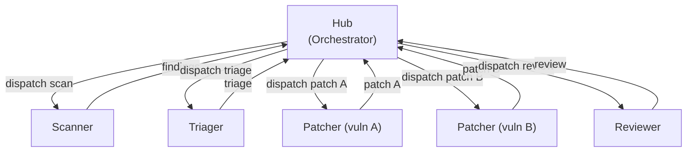
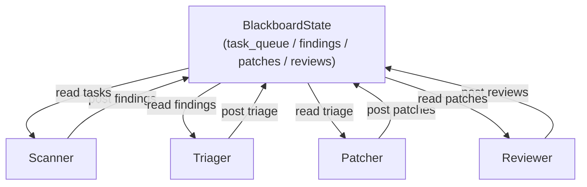

# Architecture

This document describes the three communication architectures and three memory strategies
implemented in the Multi-Agent Security Remediation Pipeline.

---

## Agent Roles

| Agent | File | Responsibility |
|-------|------|----------------|
| Scanner | `src/multi_agent_security/agents/scanner.py` | Detect vulnerable files; output `Vulnerability` objects |
| Triager | `src/multi_agent_security/agents/triager.py` | Classify severity & fix strategy; rank vulnerabilities |
| Patcher | `src/multi_agent_security/agents/patcher.py` | Generate unified diff patch; run tests; revise up to 3× |
| Reviewer | `src/multi_agent_security/agents/reviewer.py` | Accept/reject patch; provide improvement feedback |

All agents share a single `LLMClient` (`src/multi_agent_security/llm_client.py`) that wraps
Anthropic and AWS Bedrock APIs with retries, token counting, and cost tracking.

---

## Architecture A: Sequential Pipeline

Each agent runs in sequence. The output of each stage becomes the input for the next.


**Implementation**: `src/multi_agent_security/orchestration/sequential.py`
**Config**: `config/arch_sequential.yaml`
**Select**: `MASR_ARCHITECTURE=sequential`

**Characteristics**:
- Simplest to implement and debug — one agent active at a time
- Message history grows linearly with pipeline depth
- No parallelism across vulnerabilities
- Best choice for single-vulnerability, short-context workloads

---

## Architecture B: Hub-and-Spoke

A Hub agent coordinates Spoke agents (Scanner, Patcher) that can run in parallel for
independent vulnerabilities.



**Implementation**: `src/multi_agent_security/orchestration/hub_spoke.py`
**Config**: `config/arch_hub_spoke.yaml`
**Select**: `MASR_ARCHITECTURE=hub_spoke`

**Characteristics**:
- Enables parallel patch generation for multi-vulnerability repositories
- Hub adds one extra LLM call per dispatch cycle
- All context flows through the Hub — Hub failures cascade
- Best choice for repositories with multiple independent vulnerabilities

---

## Architecture C: Shared Blackboard

Agents read work items from and post results to a shared `BlackboardState`. No agent
communicates directly with another.



**Implementation**: `src/multi_agent_security/orchestration/blackboard.py`
**Config**: `config/arch_blackboard.yaml`
**Select**: `MASR_ARCHITECTURE=blackboard`

**Characteristics**:
- Maximum flexibility — add/remove agents without changing others
- Agents react to partial results from peers
- Blackboard access uses `asyncio.Lock` to prevent race conditions
- Context per agent scoped to relevant blackboard entries only
- Best choice for complex, multi-file refactors with inter-agent dependencies

---

## Memory Strategies

Memory strategies control what context each agent receives from prior pipeline stages.

### Full Context

Every agent receives the complete message history from all prior agents.

```
Agent N context = [msg_1, msg_2, ..., msg_N-1]
```

**Implementation**: `src/multi_agent_security/memory/full_context.py`
**Select**: `MASR_MEMORY_STRATEGY=full_context`
**Token usage**: O(n) — grows with pipeline depth
**Best for**: Short pipelines and small repositories

### Sliding Window + Summarization

Maintains a rolling window of the last N messages (default: N=10). Older messages are
compressed into a running summary via a secondary LLM call.

```
Agent N context = [summary_of_1..N-10, msg_N-9, ..., msg_N-1]
```

**Implementation**: `src/multi_agent_security/memory/sliding_window.py`
**Config**: `memory.sliding_window_size` (default: 10)
**Select**: `MASR_MEMORY_STRATEGY=sliding_window`
**Token usage**: O(window_size) — bounded
**Best for**: Long pipelines where older context is less relevant

### Retrieval-Augmented Scratchpad

Each agent issues a semantic query against the full message history, retrieving the top-K
most relevant messages via embedding similarity (default: K=5).

```
Agent N context = top_k_similar(query_N, [msg_1, ..., msg_N-1])
```

**Implementation**: `src/multi_agent_security/memory/retrieval.py`
**Config**: `memory.retrieval_top_k` (default: 5), `memory.embedding_model` (default: voyage-3)
**Select**: `MASR_MEMORY_STRATEGY=retrieval`
**Token usage**: O(top_k) — sub-linear
**Best for**: Large repositories where targeted context retrieval outweighs retrieval latency

---

## Configuration Matrix (9 Configs)

| Config ID | Architecture | Memory Strategy |
|-----------|-------------|-----------------|
| C1 | Sequential | Full Context |
| C2 | Sequential | Sliding Window |
| C3 | Sequential | Retrieval |
| C4 | Hub-and-Spoke | Full Context |
| C5 | Hub-and-Spoke | Sliding Window |
| C6 | Hub-and-Spoke | Retrieval |
| C7 | Blackboard | Full Context |
| C8 | Blackboard | Sliding Window |
| C9 | Blackboard | Retrieval |

Run the full matrix with:

```bash
python scripts/run_full_benchmark.py --split test --runs 3 --parallel 4
```
